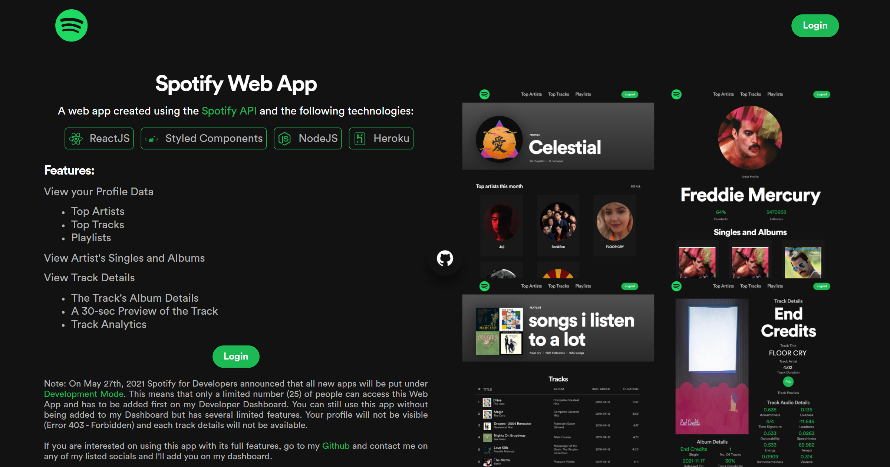

<h1 align="center"><a href='https://spotify-api-profile-app.herokuapp.com/' target='_blank' rel='noreferrer'>Spotify API Web App</a></h1>
<p align="center">

<p align="justify">
 This project is created using the <a href="https://developer.spotify.com/" target="_blank" rel='noreferrer'>Spotify API</a> and is based on Britanny Chiang's <a href="https://www.newline.co/courses/build-a-spotify-connected-app" target="_blank" rel='noreferrer'>newline course</a> with additional features. Click<a href="https://www.jeffreybernadas.tech/spotify" target="_blank" rel='noreferrer'> here </a>to learn more.</p>



## ⚒️ Built with the following technologies:

<ul>
    <li>React.js</li>
    <li>Styled Components</li>
    <li>Node.js</li>
    <li>Express.js</li>
    <li>Spotify API</li>
    <li>Heroku 🚀</li>
</ul>

## ✨ Features

<ul>
    <li>Spotify OAuth.</li>
    <li>View logged in user's:</li>
      <ul>
         <li>Followers count</li>
         <li>Top Artists (All Time/ 6 Months/ Month)</li>
         <li>Top Playlists (All Time/ 6 Months/ Month)</li>
         <li>Top Tracks (All Time/ 6 Months/ Month)</li>
      </ul>
    <li>View all Singles and Albums of an artist (including related artists).</li>
    <li>View all available tracks with their information.</li>
    <li>A 30-sec preview of the track.</li>
</ul>

## 👨‍🏫 Request for Demo

Due to the changes mentioned in the "Note section" below, accessing the web application requires an individual to be added in my own Spotify Dashboard. If by chance you are interested, just request a demo from me (Email and Spotify name are required).

## 📄 Note

All newly created app using this API are subject to the changes announced by Spotify for Developers on May 27th, 2021. A couple of features will now require the Spotify Name and Email of the user and add them on your Spotify Dashboard. [Read more](https://developer.spotify.com/community/news/2021/05/27/improving-the-developer-and-user-experience-for-third-party-apps/).

## 🛠️ Installation and Set Up

1. Install node

   ```shell
   nvm install
   ```

2. Install dependencies

   ```shell
   npm install
   ```

3. Register and Create a new Spotify App in the [Spotify Developer Dashboard](https://developer.spotify.com/dashboard).
4. Go to the App Settings and add 'http://localhost:8888/callback as a Redirect URIs.
5. Create a `.env` file at the root of the project and base it on the `.env.example` file.
6. From your Spotify Dashboard, get and add the `CLIENT_ID` and `CLIENT_SECRET` to the `.env` file inside the root.
7. Run React App on <http://localhost:3000> and Node server on <http://localhost:8888>

   ```shell
   npm start
   ```

## 🚀 Heroku Deployment with Git

1. Create your [Heroku](https://www.heroku.com) app
2. Login to Heroku

   ```shell
   heroku login
   ```

3. Add the created Heroku App as a git remote

   ```shell
   heroku git: remote -am app-name
   ```

4. In your Spotify App Settings, add "https://app-name.herokuapp.com/callback" as a Redirect URI.
5. In the Heroku Dashboard, add config vars based on the `.env` file.
6. Deploy changes

   ```shell
   git add .
   git commit -am your-comment
   ```

7. Push to Heroku

   ```shell
   git push heroku master
   ```
